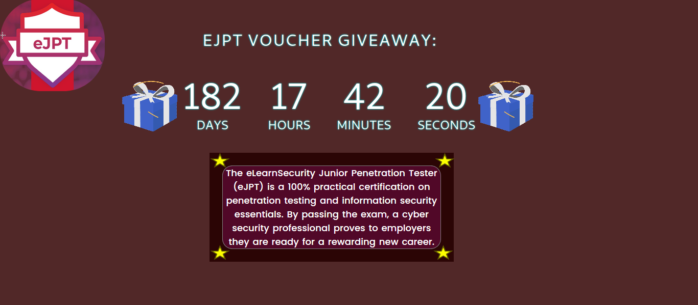

# ⏲️ Voucher-Countdown
Giveaway voucher countdown web app.
**EJPT** && **TryHackMe** Vouchers

## 🖥️ What is this web app?
This is a give away related web-app, due to a person in Neutron Nation 
hosting a give away and i immediately made a countdown to refer to the giveaway as 
a reference of the time left till it is over.

## 🎁 What is a Voucher?
A voucher is a bond of the redeemable transaction type which is worth a certain monetary value and which may be spent only for specific reasons or on specific goods. 

## TryHackMe
TryHackMe is an online platform that teaches cyber security through short, gamified real-world labs. We have content for both complete beginners and seasoned hackers, encorporating guides and challenges to cater for different learning styles.

## EJPT
The eLearnSecurity Junior Penetration Tester (eJPT) is a 100% practical certification on penetration testing and information security essentials. By passing the exam, a cyber security professional proves to employers they are ready for a rewarding new career.

## Appearance

# :octocat: Amazing Open-Source From Neutron Nation!
**Open-Source Repos:**
*Github User: ItsJeffersonLi*  
https://github.com/itsjeffersonli/AD-CheatSheet  
https://github.com/itsjeffersonli/Kali-Metapackages  

*Github User: WarenGonzaga*
https://github.com/WarenGonzaga/fork-corner  
https://github.com/WarenGonzaga/wifi-passview  
https://github.com/WarenGonzaga/googlemotanga  

>Wag Tanga e google mo!
